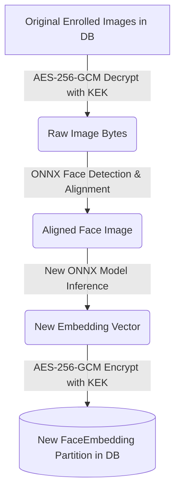

# ONNX Face Recognition Model Migration Runbook

This runbook outlines the operational steps required to upgrade or swap face recognition models in the Aegis Attendance Tracker system without requiring users to re-enroll physically. 

Biometric vectors (embeddings) generated by different models (e.g. ArcFace `buffalo_l` vs a different configuration or size) exist in different mathematical vector spaces. They cannot be compared directly. Therefore, when updating models, the system must decrypt the original enrolled face images and re-generate embeddings using the new model.

---

## Migration Architecture



The migration relies on:
1.  **Durable Original Retention**: Encrypted original images (`EnrollmentAsset`) are retained alongside user consent records.
2.  **Model Partitioning**: The `face_embeddings` table partitions records by `model_name` and `model_version`.
3.  **Active Versioning**: Kiosks and backend servers only match against the partition matching the face engine's active `model_version`.

---

## Step-by-Step Upgrade Procedure

### Step 1: Apply Database Migrations
Ensure the database has the latest schema to support both models and tracking metadata:
```bash
uv run alembic -c backend/alembic.ini upgrade head
```

### Step 2: Deploy New ONNX Model Files
Place the new ONNX model files in the target deployment directory (default `models/`):
*   `models/new_detector.onnx`
*   `models/new_recognizer.onnx`

Verify checksums against your release manifest.

### Step 3: Run the Background Re-embedding Job
With the backend server running, execute the re-embedding job script. This runs in a safe, resumable, and transactional batch loop. If interrupted, running it again will automatically skip already-completed records.

```bash
uv run python -m backend.app.cli.re_embed
```

Monitor the logs:
*   Ensure that all original images are successfully decrypted.
*   Verify that new `FaceEmbedding` records are generated and saved under the target model version.

### Step 4: Switch Active Model Settings
Update the backend environment configuration (`.env` or system variables) to activate the new model version:
```ini
FACE_RECOGNITION_MODEL=new_recognizer.onnx
```

### Step 5: Restart Backend & Bump Gallery Version
Restart the FastAPI backend process. Upon startup, the `ONNXFaceEngine` will load the new models, and the system will automatically rebuild and load the in-memory gallery index for the new model partition.

To notify all connected Kiosk devices to refresh their cached settings and index immediately, execute a gallery bump:
```bash
# This is handled automatically on backend boot, or can be triggered via:
uv run python -c "
import asyncio
from backend.app.db.session import get_session_factory
from backend.app.face.gallery import bump_gallery_version
async def main():
    async with get_session_factory()() as session, session.begin():
        await bump_gallery_version(session)
asyncio.run(main())
"
```

### Step 6: Verify Kiosk Sync
Check the FastAPI backend logs to confirm that kiosks reconnecting over WebSocket upgrade receive:
1.  A `READY` handshake message with the new gallery version.
2.  A `SETTINGS_PUSH` message confirming settings synchronization.
