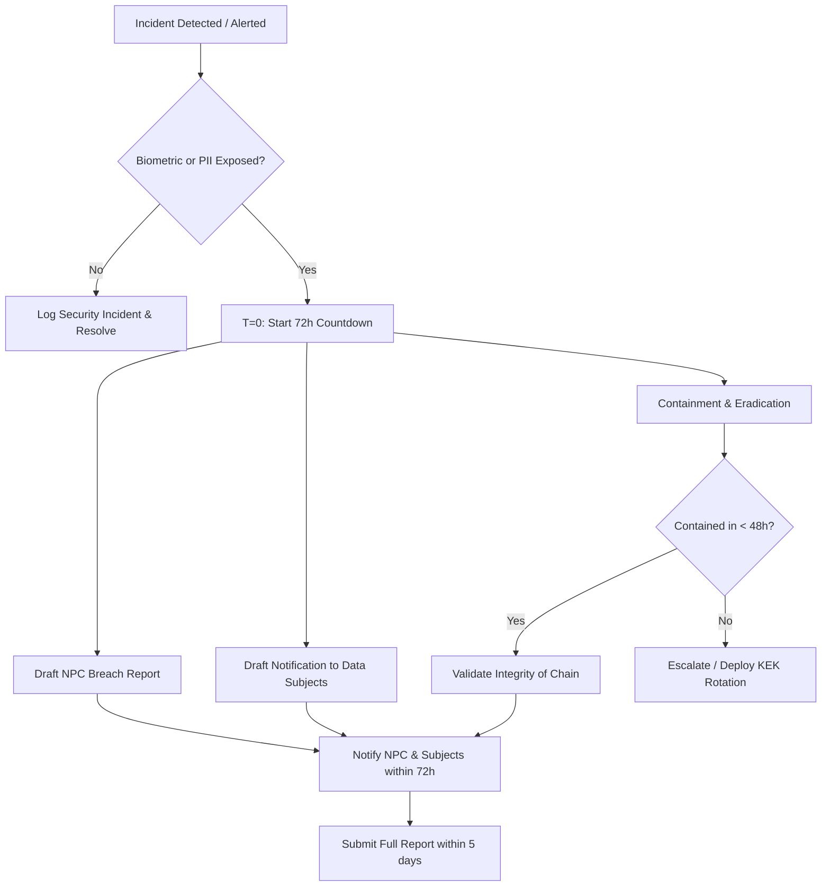

# Privacy Compliance & Breach Runbook (RA 10173)

This document establishes the compliance posture, National Privacy Commission (NPC) registration checklist, and mandatory 72-hour breach-notification runbook for the Aegis Attendance Kiosk System in accordance with the **Philippine Data Privacy Act of 2012 (RA 10173)** and its Implementing Rules and Regulations (IRR).

---

## 1. Data Protection Officer (DPO) Configuration

Under RA 10173, systems processing biometric data (classified as **Sensitive Personal Information** under Section 3(l)) for 1,000 or more individuals must designate a Data Protection Officer (DPO).

The system registers the appointed DPO's name and contact information in the global configuration:
*   **Setting Key for DPO Name**: `privacy.dpo_name` (Default: `Not Appointed`)
*   **Setting Key for DPO Contact**: `privacy.dpo_contact` (Default: `dpo@example.org`)

Ensure these are updated in the **Admin Settings Panel** or via the database before deployment.

---

## 2. NPC Registration Checklist

Since the gallery capacity is designed for up to 5,000 enrolled individuals, NPC registration is mandatory. Use the following checklist to complete registration:

- [ ] **DPO Registration**: Register the designated DPO on the official NPC registration portal (NPCS/eDPO).
- [ ] **System Registration**: Register the "Aegis Attendance Tracker" personal data processing system.
- [ ] **Data Flow Diagrams**: Prepare and upload data flow diagrams illustrating where biometric vectors are captured (Kiosk), sent (FastAPI Backend), stored (PostgreSQL Encrypted Gallery), and processed.
- [ ] **Privacy Impact Assessment (PIA)**: Complete the PIA document detailing the necessity of biometric attendance vs. PIN fallback, risk identification, and security mitigation.
- [ ] **Privacy Notice**: Publish the physical and digital consent notice shown to users during enrollment (Phase 3).
- [ ] **Security Measures Statement**:
    - [ ] Declare AES-256-GCM envelope encryption (with KEK stored outside the DB and backups).
    - [ ] Declare hard-deletion and live index convergence upon erasure (`POST /api/people/{id}/erase`).
    - [ ] Declare cryptographically chained audit trails (`AuditLog`) for all mutations.

---

## 3. 72-Hour Security Incident & Breach Runbook

Under NPC Circular No. 16-03, a security incident must be notified to the NPC and affected data subjects within **72 hours** of discovery if it involves sensitive personal information that may be used to commit identity fraud.



### Timeline & Procedures

| Hours Elapsed | Phase | Action Steps |
| :--- | :--- | :--- |
| **T + 0 hours** | **Discovery & Containment** | 1. Trigger incident response. Start the 72-hour breach clock.<br>2. Isolate compromised hardware kiosks or block API access tokens.<br>3. Locate the source of leak (e.g. log file, database dump, unauthorized node). |
| **T + 12 hours** | **Impact Assessment** | 1. Check the cryptographically chained audit logs (`AuditLog`) to determine exactly which user accounts or records were accessed.<br>2. Determine if encrypted original images or raw embeddings were exfiltrated.<br>3. Verify KEK integrity. (If KEK is compromised, immediately trigger key rotation). |
| **T + 24 hours** | **DPO Review** | 1. DPO reviews DPA Section 20 criteria to verify if risk of harm is high.<br>2. Prepare the list of affected emails/phone numbers.<br>3. Initiate draft notifications. |
| **T + 48 hours** | **Drafting Reports** | 1. Draft the NPC Notification Form.<br>2. Draft data subject notifications detailing: (a) Nature of breach, (b) Data exfiltrated, (c) Containment actions taken, (d) Recommendations to the user (e.g. password resets). |
| **T + 72 hours** | **Notification Submission** | 1. Submit the breach report to the National Privacy Commission via the official portal.<br>2. Blast email notifications to all affected individuals. |

### NPC Breach Report Template

The notification to the NPC must include:

```
REPORT OF SECURITY BREACH
Pursuant to NPC Circular No. 16-03

1. CONTACT DETAILS:
   - Organization: [Organization Name]
   - Designated DPO: [privacy.dpo_name]
   - Contact Info: [privacy.dpo_contact]

2. NATURE AND BACKGROUND OF THE INCIDENT:
   - Date and time of incident: [YYYY-MM-DD HH:MM]
   - Date and time of discovery: [YYYY-MM-DD HH:MM]
   - Description of the incident: [Explain how the breach occurred]

3. PERSONAL DATA INVOLVED:
   - Number of affected data subjects: [Count of records/people]
   - Class of data: Biometric Templates / Personal Identifiable Information (PII)
   - Specific data items: [e.g., face embeddings, preferred names, attendance logs]

4. MEASURES TAKEN / TO BE TAKEN:
   - Containment: [e.g., Blocked client IP, revoked device tokens]
   - Remediation: [e.g., Rotated envelope keys, purged logs]
```
